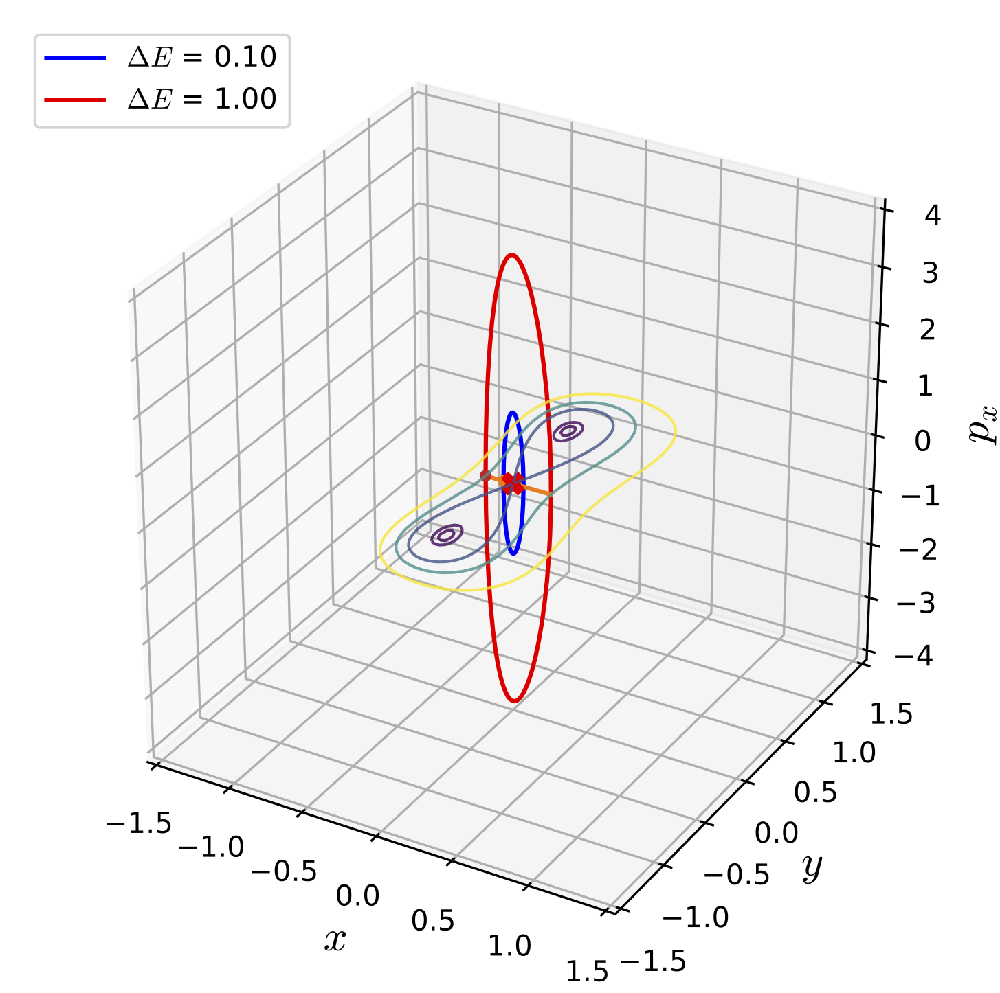

# UPOsHam

[](https://uposham.readthedocs.io/en/latest/?badge=latest) [](https://doi.org/10.5281/zenodo.3373396)

## Summary


This Python package is a collection of three methods for computing unstable periodic orbits in two degrees of freedom Hamiltonian systems that model a diverse array of problems in physical sciences and engineering [@Parker_1989; @wiggins_introduction_2003]. The unstable periodic orbits exist in the bottleneck of the equipotential line $V(x,y) = E$ and project as lines on the configuration space $(x,y)$ for the Hamiltonian system of the form kinetic plus potential energy [@wiggins_role_2016]. The three methods implemented here (and available under [src](src/) directory) has been used in [@Pollak_1980;@Deleon_Berne_1981;@koon_heteroclinic_2000;@Koon2011;@naik_geometry_2017;@ross_experimental_2018;@naik_finding_2019b] for transition dynamics in chemical reactions, celestial mechanics, and ship capsize. We have chosen three Hamiltonian systems that have two wells connected by a bottleneck where the unstable periodic orbits exist for energy above the energy of the saddle equilibrium point. A brief description of these systems can be found in the [paper](https://github.com/WyLyu/UPOsHam/tree/master/paper/paper.pdf). 


## Installation

Clone the git repository, install the requirements, and install the package manually:

```bash
$ git clone git@github.com:WyLyu/UPOsHam.git
$ cd UPOsHam
$ pip install -r requirements.txt (or pip3 install -r requirements.txt)
$ python setup.py install
```

and check the modules shown in [requirements.txt](https://github.com/WyLyu/UPOsHam/tree/master/requirements.txt) are installed using conda/pip. 


## Usage

To obtain the unstable periodic orbits for a two degree-of-freedom Hamiltonian system, one needs the expressions described in the examples section of the . These expression can then be implemented as shown in the [script](examples/deleonberne_hamiltonian.py) and the function names of the expressions can then be passed to a method's function as in the [script](examples/differential_correction_deleonberne.py)


## Tests

The example scripts that computes the unstable periodic orbits (UPOs) for a given Hamiltonian system is in the [examples](examples/) directory with names ```<method>_<system>.py```. For example, to test the computation of unstable periodic orbits (the default setting computes the UPOs for 2 values of the total energy) for the De Leon-Berne Hamiltonian [-@Deleon_Berne_1981] using the differential correction method, from the root directory call the demonstration script at the command-line using

```
$ python examples/differential_correction_deleonberne.py
```

This will save data files in the root directory and save the plot in the [./tests/plots](tests/plots/) directory.


{width="80.00000%"}

__Fig. 1. Unstable periodic orbits for De Leon-Berne Hamiltonian__


The example scripts import the system specific functions and method specific functions to obtain the UPOs. These are written as illustration of how to apply these methods to new systems. 

To obtain the unstable periodic orbits for a specific model Hamiltonian using a specific method, one uses

```bash
$ ipython
>>> run ./examples/diffcorr_UPOs_coupled.py
```

## Tests
=======

The uncoupled quartic Hamiltonian is an example of a system where the unstable periodic orbits can be obtained in explicit analytical form. This system is used for testing the numerical solutions obtained using the methods implemented in this package. 

Passing a test constitutes the following:

1. The Hausdorff distance between a given numerical and analytical orbits is within $10^{-8}$. This is implemented using Scipy's spatial module.

2. The element wise comparison test of the orbits agree upto 6 decimal places. This is performed using Numpy's testing module. 

Other nonlinear examples systems can not be solved in this explicit analytical form and these are tested by performing plotting comparison of the orbits obtained using the methods. These are available in the [Jupyter](./tests/tests.ipynb) notebook.

__Comparing the methods for the coupled quartic Hamiltonian__

We demonstrate how the UPOs computed using the different methods compare with each other for a specific system: coupled quartic Hamiltonian.

Comparison of the results (data is located [here](https://github.com/WyLyu/UPOsHam/tree/master/data)) obtained using the three methods for the coupled quartic Hamiltonian can be done using

```bash
$ ipython
>>> run ./tests/compare_methods_coupled.py
```
and the generated figure is located [here](tests/comparison_coupled.pdf)


## Contributing

Guidelines on how to contribute to this package can be found  [here](https://github.com/WyLyu/UPOsHam/blob/master/docs/contributing.md) along with the code of conduct [here](https://github.com/WyLyu/UPOsHam/blob/master/CODE_OF_CONDUCT.md) for engaging with the fellow contributors.


## Acknowledgements

We acknowledge the support of EPSRC Grant No. EP/P021123/1 and Office of Naval Research (Grant No. N00014-01-1-0769). The authors would like to acknowledge the London Mathematical Society and School of Mathematics at the University of Bristol for supporting the undergraduate research bursary 2019. We acknowledge contributions from Shane Ross for writing the early MATLAB version of the differential correction and numerical continuation code.


## Copyright and License
Copyright 2019 Wenyang Lyu, Shibabrat Naik, Stephen Wiggins. 

All content is under Creative Commons Attribution [CC-BY 4.0](https://creativecommons.org/licenses/by/4.0/legalcode.txt) and all the python scripts are under [BSD-3 clause](https://github.com/WyLyu/UPOsHam/blob/master/LICENSE).

## References


