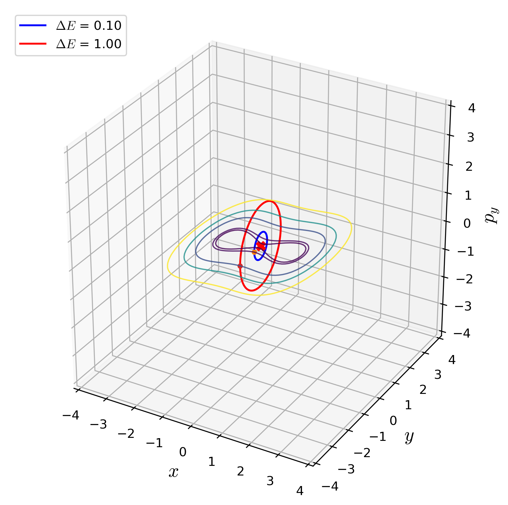

-   [UPOsHam](#uposham)
    -   [Summary](#summary)
    -   [Installation](#installation)
    -   [Usage](#usage)
    -   [Tests](#tests)
    -   [Contributing](#contributing)
    -   [Acknowledgements](#acknowledgements)
    -   [Copyright and License](#copyright-and-license)
    -   [References](#references)

UPOsHam
=======

[](https://uposham.readthedocs.io/en/latest/?badge=latest)
[](https://doi.org/10.5281/zenodo.3373396)

Summary
-------

This Python package is a collection of three methods for computing
unstable periodic orbits in two degrees of freedom Hamiltonian systems
that model a diverse array of problems in physical sciences and
engineering (Parker and Chua [1989](#ref-Parker_1989); Wiggins
[2003](#ref-wiggins_introduction_2003)). The unstable periodic orbits
exist in the bottleneck of the equipotential line *V*(*x*, *y*) = *E*
and project as lines on the configuration space (*x*, *y*) for the
Hamiltonian system of the form kinetic plus potential energy (Wiggins
[2016](#ref-wiggins_role_2016)). The three methods implemented here (and
available under [src](src/) directory) has been used in (Pollak, Child,
and Pechukas [1980](#ref-Pollak_1980); De Leon and Berne
[1981](#ref-Deleon_Berne_1981); Koon et al.
[2000](#ref-koon_heteroclinic_2000), [2011](#ref-Koon2011); Naik and
Ross [2017](#ref-naik_geometry_2017); Ross et al.
[2018](#ref-ross_experimental_2018); Naik and Wiggins
[2019](#ref-naik_finding_2019b)) for transition dynamics in chemical
reactions, celestial mechanics, and ship capsize. We have chosen three
Hamiltonian systems that have two wells connected by a bottleneck where
the unstable periodic orbits exist for energy above the energy of the
saddle equilibrium point. A brief description of these systems can be
found in the
[paper](https://github.com/WyLyu/UPOsHam/tree/master/paper/paper.pdf).

Installation
------------

Clone the git repository and install `uposham` as a module using

``` bash
$ git clone git@github.com:WyLyu/UPOsHam.git
$ cd UPOsHam
$ python setup.py install
```

Then `uposham` is available for import along with the methods and
example systems as submodules, for example

``` python
import uposham.differential_correction as diffcorr
import uposham.deleonberne_hamiltonian as deleonberne
```

To be sure check the modules shown in
[requirements.txt](https://github.com/WyLyu/UPOsHam/tree/master/requirements.txt)
are installed using

``` bash
$ pip install -r requirements.txt (or pip3 install -r requirements.txt)
```

Usage
-----

To obtain the unstable periodic orbits for a two degree-of-freedom
Hamiltonian system, one needs the expressions described in the examples
section of the
[documentation](https://uposham.readthedocs.io/en/latest/?badge=latest).
These expression can then be implemented as functions as shown in the
[script](examples/deleonberne_hamiltonian.py) and the function names of
the expressions can then be passed to a method’s function as in the
[script](examples/differential_correction_deleonberne.py). The example
script that computes the unstable periodic orbits (UPOs) for a given
Hamiltonian system is in the [examples](examples/) directory with names
`<method>_<system>.py`. The example scripts show how the method specific
functions take the system specific functions as input and are meant as
demonstration of how to set-up computation for a new system using the
available methods.

The user will need to write the system specific functions in a script,
import this as module, import one of the method as module, and pass the
system specific functions to the method specific functions.

**Solving the De Leon-Berne Hamiltonian system using differential
correction method**

For example, to test the computation of unstable periodic orbits (the
default setting computes the UPOs for 2 values of the total energy) for
the De Leon-Berne Hamiltonian ([1981](#ref-Deleon_Berne_1981)) using the
differential correction method, the demonstration script can be called
from the root directory at the command-line using

``` bash
$ python examples/differential_correction_deleonberne.py
```

This will save data files in the root directory and save the plot in the
[./tests/plots](tests/plots/) directory.


**Fig. 1. Unstable periodic orbits for De Leon-Berne Hamiltonian**

**Solving the coupled quartic Hamiltonian system using differential
correction method**

To perform these computations using ipython, for example to obtain the
unstable periodic orbits for the coupled quartic Hamiltonian using the
differential correction, the user can execute:

``` bash
$ ipython
>>> run ./examples/differential_correction_coupled.py
```

This will save data files in the root directory and save the plot in the
[./tests/plots](tests/plots/) directory.


**Fig. 2. Unstable periodic orbits for the coupled quartic Hamiltonian**

Tests
-----

The uncoupled quartic Hamiltonian is an example of a system where the
unstable periodic orbits can be obtained in explicit analytical form.
This system is used for testing the numerical solutions obtained using
the methods implemented in this package.

**Unit test**

Passing a test constitutes the following:

1.  The Hausdorff distance between a given numerical and analytical
    orbits is within 10<sup> − 8</sup>. This is implemented using
    Scipy’s spatial module.

2.  The element wise comparison test of the orbits agree upto 6 decimal
    places. This is performed using Numpy’s testing module.

Other nonlinear examples systems can not be solved in this explicit
analytical form and these are tested by performing plotting comparison
of the orbits obtained using the methods. These are available in the
[Jupyter](./tests/tests.ipynb) notebook.

**Comparing the methods for the coupled quartic Hamiltonian**

We demonstrate how the UPOs computed using the different methods compare
with each other for a specific system: coupled quartic Hamiltonian.

Comparison of the results (data is located
[here](https://github.com/WyLyu/UPOsHam/tree/master/data)) obtained
using the three methods for the coupled quartic Hamiltonian can be done
using

``` bash
$ ipython
>>> run ./tests/compare_methods_coupled.py
```

and the generated figure is located
[here](tests/plots/comparison_coupled.pdf)

Contributing
------------

Guidelines on how to contribute to this package can be found
[here](https://github.com/WyLyu/UPOsHam/blob/master/docs/contributing.md)
along with the code of conduct
[here](https://github.com/WyLyu/UPOsHam/blob/master/CODE_OF_CONDUCT.md)
for engaging with the fellow contributors.

Acknowledgements
----------------

We acknowledge the support of EPSRC Grant No. EP/P021123/1 and Office of
Naval Research (Grant No. N00014-01-1-0769). The authors would like to
acknowledge the London Mathematical Society and School of Mathematics at
the University of Bristol for supporting the undergraduate research
bursary 2019. We acknowledge contributions from Shane Ross for writing
the early MATLAB version of the differential correction and numerical
continuation code.

Copyright and License
---------------------

Copyright 2019 Wenyang Lyu, Shibabrat Naik, Stephen Wiggins.

All content is under Creative Commons Attribution [CC-BY
4.0](https://creativecommons.org/licenses/by/4.0/legalcode.txt) and all
the python scripts are under [BSD-3
clause](https://github.com/WyLyu/UPOsHam/blob/master/LICENSE).

References
----------

De Leon, Nelson, and B. J. Berne. 1981. “Intramolecular Rate Process:
Isomerization Dynamics and the Transition to Chaos.” *The Journal of
Chemical Physics* 75 (7): 3495–3510. <https://doi.org/10.1063/1.442459>.

Koon, Wang Sang, Martin W. Lo, Jerrold E. Marsden, and Shane D. Ross.
2000. “Heteroclinic Connections Between Periodic Orbits and Resonance
Transitions in Celestial Mechanics.” *Chaos: An Interdisciplinary
Journal of Nonlinear Science* 10 (2): 427–69.
<https://doi.org/10.1063/1.166509>.

Koon, W. S., M. W. Lo, J. E. Marsden, and S. D. Ross. 2011. *Dynamical
systems, the three-body problem and space mission design*. Marsden
books. [ISBN: 978-0-615-24095-4](ISBN: 978-0-615-24095-4).

Naik, Shibabrat, and Shane D. Ross. 2017. “Geometry of Escaping Dynamics
in Nonlinear Ship Motion.” *Communications in Nonlinear Science and
Numerical Simulation* 47 (June): 48–70.
<https://doi.org/10.1016/j.cnsns.2016.10.021>.

Naik, Shibabrat, and Stephen Wiggins. 2019. “Finding Normally Hyperbolic
Invariant Manifolds in Two and Three Degrees of Freedom with
Hénon-Heiles-Type Potential.” *Phys. Rev. E* 100 (2): 022204.
<https://doi.org/10.1103/PhysRevE.100.022204>.

Parker, T. S., and L. O. Chua. 1989. *Practical Numerical Algorithms for
Chaotic Systems*. New York, NY, USA: Springer-Verlag New York, Inc.
[ISBN: 0-387-96689-7](ISBN: 0-387-96689-7).

Pollak, Eli, Mark S. Child, and Philip Pechukas. 1980. “Classical
Transition State Theory: A Lower Bound to the Reaction Probability.”
*The Journal of Chemical Physics* 72 (3): 1669–78.
<https://doi.org/10.1063/1.439276>.

Ross, Shane D., Amir E. BozorgMagham, Shibabrat Naik, and Lawrence N.
Virgin. 2018. “Experimental Validation of Phase Space Conduits of
Transition Between Potential Wells.” *Phys. Rev. E* 98 (5): 052214.
<https://doi.org/10.1103/PhysRevE.98.052214>.

Wiggins, Stephen. 2003. *Introduction to Applied Nonlinear Dynamical
Systems and Chaos*. 2nd ed. Texts in Applied Mathematics 2. New York:
Springer. [ISBN: 978-0-387-00177-7](ISBN: 978-0-387-00177-7).

———. 2016. “The Role of Normally Hyperbolic Invariant Manifolds (NHIMs)
in the Context of the Phase Space Setting for Chemical Reaction
Dynamics.” *Regular and Chaotic Dynamics* 21 (6): 621–38.
<https://doi.org/10.1134/S1560354716060034>.
