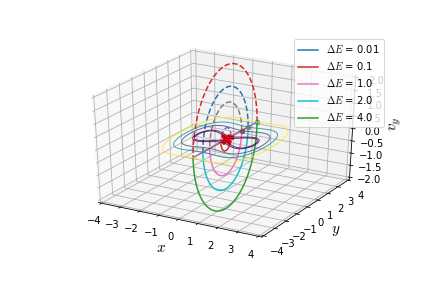
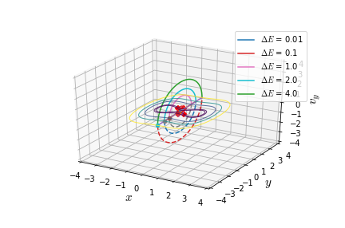
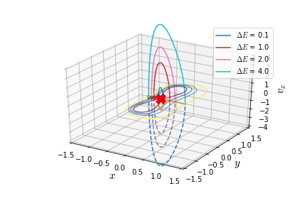

**[Software repository](https://github.com/WenYangLyu/UPOsHam)**

## Statement of Need

In Hamiltonian dynamical systems the fundamental phase space structure that partitions dynamically disparate trajectories and mediates transition between multi-stable regions is an invariant manifold. These are anchored to the normally hyperbolic invariant manifold in a general N degree of freedom system and this becomes an unstable periodic orbit in the two degree of freedom case [@wiggins_role_2016]. This Python package provides a collection of three different methods for computing the unstable periodic orbits (UPOs) at a specified total energy. Even though, there is no lack of numerical methods for this computing UPOs, we have found they either lack in reproducibility or written using closed source software. Our aim is to provide an open source package that implements the three methods and shows examples for applied scientists.

## Summary

UPOsHam is a collection of three useful methods for computing unstable periodic orbits in Hamiltonian systems that model a diverse array of problems in physical sciences and engineering. The methods have been implemented for [three example Hamiltonian systems](#examples) that are prototypical models of chemical reactions. 

We show few example computations of the unstable periodic orbit for these examples in Fig. \ref{fig:uncoupled}.

## Features

In this package, the user has the option to choose between the three methods described below. These are implemented in separate scripts with functions that can be modified to define the Hamiltonian total energy, potential energy, vector field, Jacobian, variational equations [@Parker_1989].   

### Turning point

Hamiltonian systems of the form kinetic plus potential energy have unstable periodic orbits in the bottleneck that touches the equipotential lines given by $V(x,y) = E$. This method is based on finding the UPO by checking for trajectories that turn in the opposite directions and iteratively bringing them closer to approximate the UPO [@Pollak_1980].

### Differential turning point

### Differential correction and numerical continuation

## Examples {#examples}

Consider the following two degrees-of-freedom Hamiltonian model of a reaction in a bath (solvent) 

### Uncoupled quartic Hamiltonian

\begin{equation}
    \mathcal{H}(x,y,p_x,p_y) = \frac{p_x^2}{2} - \alpha \frac{x^2}{2} + \beta \frac{x^4}{4} + \frac{\omega}{2}\left( p_y^2 + y^2 \right)
\end{equation}

### Coupled quartic Hamiltonian

\begin{equation}
    \mathcal{H}(x,y,p_x,p_y) = \frac{p_x^2}{2} - \alpha \frac{x^2}{2} + \beta \frac{x^4}{4} + \frac{\omega}{2}\left( p_y^2 + y^2 \right) + \frac{\epsilon}{2}(x - y)^2
\end{equation}

### DeLeon-Berne Hamiltonian {#dbham}

This Hamiltonian has been studied in chemical reaction dynamics as a model of isomerization of a single molecule that undergoes structural changes [@Deleon_Berne_1981; @DeLeon_Marston_1989]. This model Hamiltonian exhibits chaotic dynamics when the coupling between the double well and Morse oscillator is increased.

\begin{equation}
\mathcal{H}(x,y,p_x,p_y) = T(p_x, p_y) + V_{\rm DB}(x, y) = \frac{p_x^2}{2m_A} + \frac{p_y^2}{2m_B} + V_{\rm DB}(x, y)
\end{equation}    
where the potential energy function $V_{\rm DB}(x,y)$ is 

\begin{equation}
\begin{aligned}
V_{\rm DB}(x,y) = &  V(x) + V(y) + V(x,y) \\
V(y) = & 4y^2(y^2 - 1) + \epsilon_s \\
V(x) = & D_x\left[ 1 - \exp(-\lambda x) \right]^2 \\
V(x,y) = & 4y^2(y^2 - 1)\left[ \exp(-\zeta \lambda x) - 1 \right]
\end{aligned}
\label{eqn:pot_energy_db}
\end{equation}

The parameters in the model are $m_A, m_B$ which represent mass of the isomers, while $\epsilon_s, D_x$ denote the energy of the saddle, dissociation energy of the Morse oscillator, respectively, and will be kept fixed in this study, $\lambda, \zeta$ denote the range of the Morse oscillator and coupling parameter between the $x$ and $y$ configuration space coordinates, respectively.

## Visualization: Unstable periodic orbits in the bottleneck

## Relation to ongoing research projects

We are developing geometric methods of phase space transport in the context of chemical reaction dynamics that rely heavily on identifying and computing the unstable periodic orbits. Manuscript related to the [De Leon-Berne model](#dbham) is under preparation.

## Acknowledgements

We acknowledge the support of EPSRC Grant No. EP/P021123/1 and Office of Naval Research (Grant No. N00014-01-1-0769). The authors would like to acknowledge the London Mathematical Society and School of Mathematics at University of Bristol for supporting the undergraduate research bursary. We acknowledge contributions from Shane Ross for writing the early MATLAB version of the differential correction and numerical continuation code.

## References

